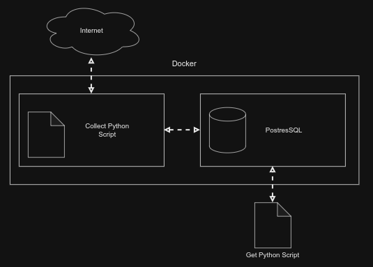

# BooksCollector
Test pet-project for practice Docker and Docker-Swarm

### Test pet-project for practice Docker and Docker-Swarm

### Plan 
- [x] Create script which will collect best books form [Yakaboo](https://www.yakaboo.ua/ua/knigi/dobirki-yakaboo.html)
- [X] Create docker/docker compose file which will create 2 containers. One for python script. Second one for PostgressDB.
- [X] Make collect python script save all datas in DB.
- [] Add logging to code
- [] Optimize, rewrite code, change all todo places.
- [] Add docker volume for logs.
- [] Create script for getting data from DB in CSV format.
- [] change diagram.
- [] add description to project, and describe stack.

### How to use docker
